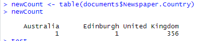
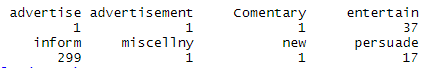
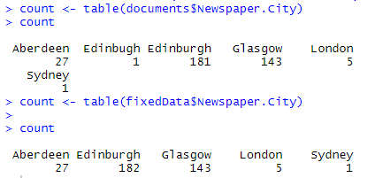
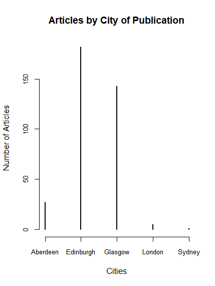

## Excel & R:
### Do you see any other error(s) in the plot? How would you correct it(them)?
- Yes, in the country column one of the entries says "Edinburgh" when it should be in the "United Kingdom" section. 

- Also, for the Article.Type set, there are entries that contain "advertise" and "advertisement" as different types. 

- In order to try and fix up the data, I tried using OpenRefine, which we used last week; however, whilst it was able to recognise the similarity between "Edinburgh" and "Edinbugh", when merging them, it resulted in 2 entries for each year, both relating to the city of Edinburgh. In retrospect, I had done this to data that had already been manipulated by the system as I used a couple lines to convert a table to a data-frame and then got that data-frame written to a new .csv file... 
- Having extract the whole data set and run it through open-refine, I was able to correct all of the errors that I found in the dataset.

### Is this an artefact of the data, or of our collection methods?
- I'd say that the fact that the data has 3 large peaks around 1789, 1819, and the late 1830s is more of an artefact of the collection method then the data itself as I find it hard to believe that between the years 1794 and 1802 and 1802 and 1810, that there were no newspaper articles on the subject of colonies from any resources accessed. Furthermore, I find some of the outliers in the data set especially strange...

- Ignoring the aforementioned error in the presence of "Edinburgh" as a country, the strangest thing about the data set is the presence of one article from Australia, which is really out of place when the other 357 articles are all from the United Kingdom. In my opinion, the presence of this article is indicative of some possible flaws in the data collection method used. However, these oddities in the data could be explained in a number of different ways, such as it is obviously not possible to find every article relating to colonialism in newspapers from this time range, for various reasons such as limited time and personnel or the lack of availability of the original documents. 

### What other patterns do you see that are worth investigating?
- The other pattern that I think is most worth looking into is the similarities between all the articles that weren't published in Edinburgh vs. the rest of the cities. This would include looking at the 5 London articles in this data set, all of which were from 1817, the majority of the articles from Glasglow which came out in only 5 years of the 53 year period being analysed here, and the singular article from Sydney. 

## Voyant
- https://voyant-tools.org/?corpus=7b47f468a6a3a303c9fee74a6b21d0d8
### Technical Failures:
- Voyant doesn't seem to agree with me, seemingly every other time I try to do something on it, a blank error message appears and I have to refresh the page, I managed to get through all of it, although that was a bit annoying. 
### Does anything jump out at you? Click on the term. What changes in Voyant?
- 
