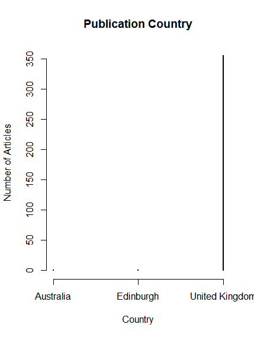

##Excel & R:
### Do you see any other error(s) in the plot? How would you correct it(them)?
- Yes, in the country column one of the entries says "Edinburgh" when it should be in the "United Kingdom" section. 
- Also, for the Article.Type set, there are entries that contain "advertise" and "advertisement" as different types. 

- I'd say that the fact that the data has 3 large peaks around 1789, 1819, and the late 1830s is more of an artefact of the collection method then the data itself as I find it hard to believe that between the years 1794 and 1802 and 1802 and 1810, that there were no newspaper articles on the subject of colonies from any resources accessed. Furthermore, I find some of the outliers in the data set especially strange...

Ignoring the obvious error in the presence of "Edinburgh" as a country, the strangest thing about the data set is the presence of one article from Australia, which is really out of place when the other 357 articles are all from the United Kingdom. In my opinion, the presence of this article is indicative of some possible flaws in the data collection method used. However, these oddities in the data could be explained in a number of different ways, such as it is obviously not possible to find every article relating to colonialism in newspapers from this time range, for various reasons such as limited time and personnel or the lack of availability of the original documents. 
- 
